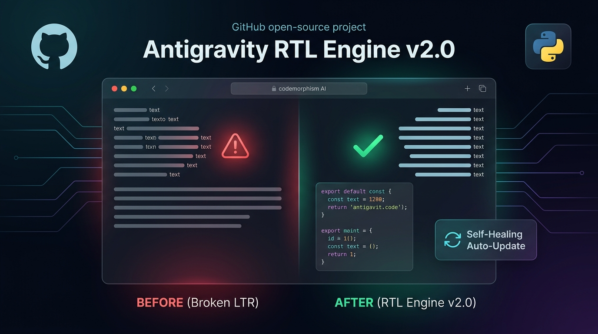
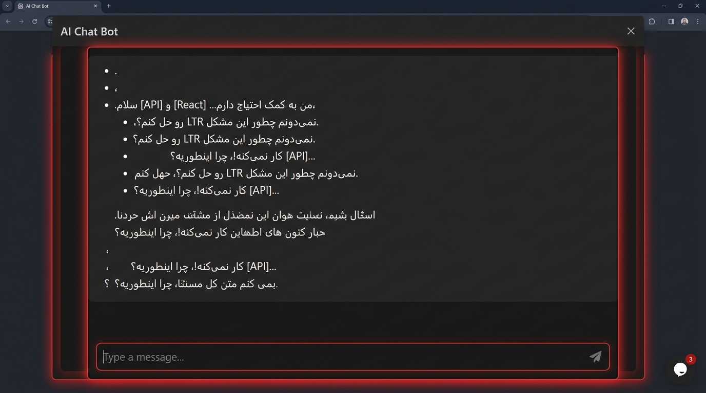
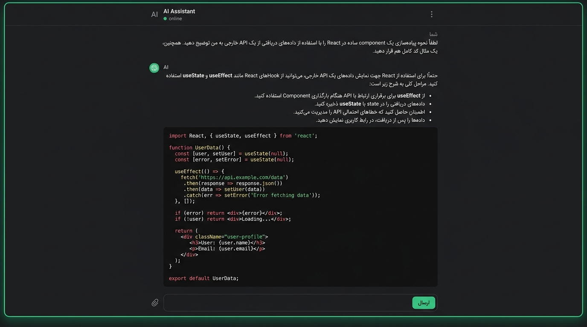

<div align="center">



<br />

# 🚀 Antigravity RTL Engine `v2.0`
### پچ راست‌چین، اصلاح چیدمان دوجهته (BiDi) و فارسی‌ساز هوشمند برای **Google Antigravity**
#### *مجهز به سیستم خودترمیم خودکار (Self-Healing) مقاوم در برابر آپدیت‌های برنامه*

<p align="center">
  
  
  
  
  <a href="https://github.com/alinezamifar/Antigravity-RTL/stargazers">
    
  </a>
</p>

</div>

---

<div dir="rtl" align="right">

## 📸 مقایسه قبل و بعد از نصب پچ (Before & After)

در محیط پیش‌فرض **Google Antigravity**، تمام پیام‌ها و کادرهای متنی به صورت چپ‌به‌راست (`LTR`) رندر می‌شوند که باعث پرش علائم نگارشی، معکوس شدن جملات ترکیبی فارسی/انگلیسی و چپ‌چین ماندن لیست‌ها می‌گردد. با نصب **Antigravity RTL Engine**، تمام این مشکلات به صورت هوشمند برطرف می‌شوند:

<table width="100%">
  <thead>
    <tr>
      <th width="50%" align="center">❌ قبل از نصب (حالت پیش‌فرض و به‌هم‌ریخته)</th>
      <th width="50%" align="center">✅ بعد از نصب (راست‌چین استاندارد + حفظ ساختار کدها)</th>
    </tr>
  </thead>
  <tbody>
    <tr>
      <td align="center">
        
        <br />
        <sub>پرش نقطه‌ها به ابتدای خط، به‌هم‌ریختگی کلمات انگلیسی در متن فارسی و چپ‌چین بودن بولت‌پوینت‌ها</sub>
      </td>
      <td align="center">
        
        <br />
        <sub>راست‌چین شدن کامل پیام‌ها و تیترها، ایزوله‌سازی کدها و دست‌نخورده ماندن ترمینال</sub>
      </td>
    </tr>
  </tbody>
</table>

---

## ✨ ویژگی‌ها و قابلیت‌های کلیدی

| قابلیت | توضیح عملکرد |
| :--- | :--- |
| 🧠 **تشخیص هوشمند جهت (`dir="auto"`)** | پاراگراف‌ها، تیترها و پیام‌هایی که با حروف فارسی یا عربی شروع می‌شوند به طور خودکار راست‌چین (`RTL`) شده و متون انگلیسی کاملاً چپ‌چین (`LTR`) باقی می‌مانند. |
| 🔒 **ایزوله‌سازی کدهای درون‌خطی (`unicode-bidi: isolate`)** | نام توابع، مسیر فایل‌ها، پکیج‌ها و تگ‌های `code` در وسط جملات فارسی دیگر باعث پریدن نقطه، دونقطه یا پرانتزها به اول خط نمی‌شوند. |
| 💻 **حفاظت ۱۰۰٪ از بلوک‌های کد و ترمینال** | تمامی بلوک‌های کد (`pre`, `code`)، دستورات ترمینال و لاگ‌ها با فونت Monospace و جهت چپ‌به‌راست استاندارد حفظ می‌شوند. |
| ⌨️ **کادر تایپ دوزبانه هوشمند** | به محض تایپ اولین کلمه فارسی در کادر ورودی پیام (Prompt)، جهت کادر راست‌چین شده و با تایپ انگلیسی مجدداً چپ‌چین می‌گردد. |
| ⚡ **پشتیبانی بدون لگ از پاسخ‌های زنده (Streaming)** | استفاده از `MutationObserver` بهینه‌شده با `requestAnimationFrame` که حین تایپ لحظه‌ای هوش مصنوعی بدون هیچ‌گونه افت سرعتی کار می‌کند. |
| 🎨 **بهبود تایپوگرافی و خوانایی فارسی** | تنظیم استاندارد فاصله خطوط (`line-height: 1.85`) و اولویت‌بندی فونت‌های فارسی (`Vazirmatn`, `Shabnam`, `Segoe UI`, `Tahoma`). |

---

## 🛡️ سیستم خودترمیم دولایه در برابر آپدیت‌ها (Self-Healing v2.0)

یکی از مشکلات رایج پچ‌های Electron این است که با هر بار آپدیت شدن برنامه، فایل `app.asar` جایگزین شده و پچ از بین می‌رود. در **نسخه ۲.۰**، یک معماری **دولایه خودترمیم** پیاده‌سازی شده است تا **دیگر هیچ‌گاه نیاز به اجرای دستی مجدد نداشته باشید**:

1. **لایه اول — سرویس سبک پس‌زمینه (`antigravity_rtl_watcher.pyw`)**:
   - در استارت‌آپ ویندوز ثبت شده و از طریق `pythonw.exe` (کاملاً مخفی، بدون پنجره کنسول و با مصرف صفر CPU) در پس‌زمینه اجرا می‌شود.
   - به محض اینکه Antigravity آپدیت شود و فایل `app.asar` تغییر کند، ظرف **۲ تا ۳ ثانیه** نسخه جدید را پچ کرده و هم‌زمان استایل راست‌چین را به صورت زنده (`Live CDP Injection`) به پنجره باز برنامه تزریق می‌کند.
2. **لایه دوم — هوک سراسری خودترمیم (`~/.gemini/config/hooks.json`)**:
   - در پوشه تنظیمات سراسری کاربر (که خارج از پوشه نصب برنامه است و در هیچ آپدیتی پاک نمی‌شود) ثبت می‌گردد.
   - حتی اگر سرویس پس‌زمینه به هر دلیلی بسته شده باشد، به محض ارسال اولین پیام در هر پروژه‌ای، خودِ Antigravity این هوک را اجرا کرده و در کسری از ثانیه پچ راست‌چین و سرویس پس‌زمینه را احیا می‌کند.

---

## 🚀 راهنمای نصب و راه‌اندازی سریع

### روش اول: نصب با یک کلیک (پیشنهادی)
کافیست پروژه را دانلود یا Clone کرده و روی فایل **`install.bat`** دوبار کلیک کنید:

</div>

<div dir="ltr" align="left">

```bash
git clone https://github.com/alinezamifar/Antigravity-RTL.git
cd Antigravity-RTL
install.bat
```

</div>

<div dir="rtl" align="right">

> 💡 **نکته:** بلافاصله پس از اجرای `install.bat`، حتی اگر برنامه Antigravity در همان لحظه باز باشد، بدون نیاز به بستن و باز کردن مجدد برنامه، محیط شما در جا راست‌چین خواهد شد!

---

### روش دوم: استفاده از دستورات خط فرمان (CLI)

</div>

<div dir="ltr" align="left">

```bash
# مشاهده وضعیت فعلی پچ، سرویس پس‌زمینه و هوک سراسری
python antigravity_rtl.py --status

# نصب دائمی پچ + فعال‌سازی سیستم خودترمیم آپدیت + تزریق زنده
python antigravity_rtl.py --patch

# تزریق زنده و موقت به پنجره باز برنامه (بدون تغییر در فایل‌های روی دیسک)
python antigravity_rtl.py --live

# حذف کامل پچ، غیرفعال‌سازی سرویس خودکار و بازگردانی به نسخه اورجینال کارخانه
python antigravity_rtl.py --unpatch
```

</div>

<div dir="rtl" align="right">

---

## 📁 ساختار فایل‌های پروژه

| نام فایل | کاربرد و وظیفه |
| :--- | :--- |
| [`antigravity_rtl.py`](./antigravity_rtl.py) | هسته اصلی مدیریت آرشیو `asar`، پشتیبان‌گیری خودکار (`app.asar.bak`)، تزریق زنده CDP و تنظیم استارت‌آپ/هوک |
| [`rtl_engine.js`](./rtl_engine.js) | موتور جاوااسکریپت و قوانین CSS هوشمند برای مدیریت `dir="auto"` و `unicode-bidi: isolate` |
| [`antigravity_rtl_watcher.pyw`](./antigravity_rtl_watcher.pyw) | سرویس مخفی پس‌زمینه برای تشخیص آنی آپدیت‌های برنامه و اعمال خودکار پچ |
| [`antigravity_rtl_hook.py`](./antigravity_rtl_hook.py) | اسکریپت هوک سراسری `PreInvocation` جهت خودترمیمی خودکار در صورت بسته بودن سرویس |
| [`install.bat`](./install.bat) | نصب دائمی و فعال‌سازی کامل با یک کلیک |
| [`uninstall.bat`](./uninstall.bat) | حذف کامل پچ و بازگردانی فوری به نسخه اصلی (`app.asar.bak`) |
| [`apply_live.bat`](./apply_live.bat) | تزریق زنده لحظه‌ای به پنجره در حال اجرا بدون ری‌استارت |

---

<details>
<summary><b>🌐 English Documentation (Click to Expand)</b></summary>

<div dir="ltr" align="left">

<br />

### Overview
**Antigravity RTL Engine v2.0** resolves Right-to-Left (Persian, Arabic, Hebrew, Urdu) bidirectional rendering issues in **Google Antigravity** without breaking code blocks, terminal outputs, or inline technical expressions.

### Key Highlights
- **Automatic Direction Detection (`dir="auto"`)**: Dynamically applies RTL direction and right alignment to paragraphs, headings, lists, and chat bubbles starting with RTL script while keeping English elements strictly LTR.
- **Inline Code Isolation (`unicode-bidi: isolate`)**: Prevents inline English words, file paths, and `<code>` tags from scrambling punctuation or sentence order inside RTL paragraphs.
- **Strict Code & Terminal Protection**: All `<pre>`, `<code>`, and terminal containers remain 100% LTR and left-aligned.
- **Dual-Layer Self-Healing Across Updates**:
  1. **Silent Background Watcher (`antigravity_rtl_watcher.pyw`)**: Runs via `pythonw.exe` on Windows Startup, detecting `app.asar` changes after auto-updates and re-patching + live-injecting via Chrome DevTools Protocol within seconds.
  2. **Global PreInvocation Hook (`~/.gemini/config/hooks.json`)**: Stored in user config untouched by updates; automatically restores the patch and restarts the watcher if ever needed.

</div>
</details>

---

## ❤️ حمایت و مشارکت
اگر این ابزار برای شما مفید بود، لطفاً با دادن یک **ستاره (⭐ Star)** در بالای صفحه گیت‌هاب از پروژه حمایت کنید تا سایر توسعه‌دهندگان فارسی‌زبان نیز راحت‌تر آن را پیدا کنند!

</div>
